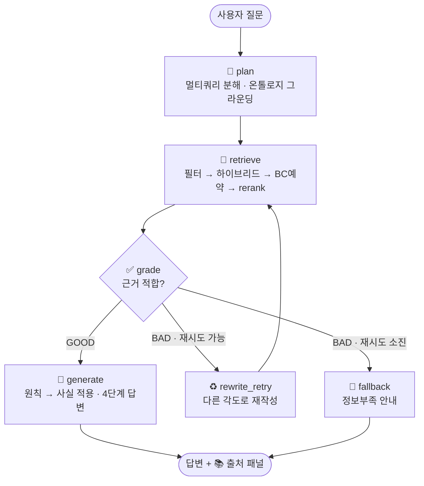

# 📚 K-IFRS SPC 회계 질의응답 챗봇

> 한국채택국제회계기준(**K-IFRS**) 기준서를 근거로, **SPC(특수목적기업) 연결 판단**을 비롯한
> 회계 질문에 **이론·실무 관점**과 **명확한 출처**를 함께 제시하는 RAG(검색증강생성) 챗봇.


---

## 📖 서비스 소개

회계 실무자가 *"우리가 설립한 SPC를 연결재무제표에 포함해야 하나?"* 와 같은 질문을 입력하면,
관련 K-IFRS 기준서를 검색해 **기준서 문단을 근거로** 답합니다. 단순 정의 나열이 아니라,
**원칙을 질문의 사실관계에 적용해 결론**을 제시하고, **참고한 기준서·페이지·문단을 출처로 보장 표시**합니다.

- **대상** — K-IFRS 적용 기업의 회계 실무자, 회계 학습자
- **범위(프로토타입)** — SPC 연결 판단에 필요한 **12개 핵심 기준서**
  (제1110호 연결재무제표 · 제1109호 금융상품 · 제1113호 공정가치 · 제1116호 리스 · 제1027호 별도재무제표 ·
  제1112호 지분공시 · 제1032/1107호 금융상품 · 제1001호 표시 · 제1007호 현금흐름 · 제1012호 법인세 · 재무보고 개념체계)
- **인덱스 규모** — 약 3,900개 청크(Pinecone, 1536차원, cosine)

### 차별점
| | 내용 |
|---|---|
| 🔀 **이론 + 실무 분해** | 실무 질문을 *정의/요건*(이론)과 *적용/판단/사례*(실무) 하위질문으로 분해해 폭넓게 검색 |
| 📚 **근거 보장** | 모든 답변 하단에 **실제 검색된** 기준서·페이지·문단·섹션을 출처 패널로 표시 (LLM 서술과 독립) |
| 🧠 **판단하는 답변** | 근거가 충분하면 *"연결한다/하지 않는다"* 처럼 결론을 내리되, 결론을 바꿀 가정도 함께 명시 |
| 🚫 **환각 억제** | 기준서에 근거가 없으면 단정하지 않음 |

---

## 🏗️ 아키텍처

### 질의 파이프라인 (LangGraph)



**`retrieve` 내부 단계**
1. **필터링** — 온톨로지가 추론한 `기준서 ∧ 섹션(본문)` 필터로 시작, 결과 부족 시 자동 완화(섹션만 → 기준서만 → 무필터)
2. **하이브리드 검색** — dense(Pinecone MMR) + sparse(BM25)를 **RRF**로 융합
3. **BC 예약석** — SPC 등 특정 개념은 결론도출근거(BC)를 별도 검색해 일부 슬롯 보장
4. **재정렬** — 멀티쿼리 결과를 통합하고, **원 질문 기준**으로 cross-encoder rerank → 상위 `TOP_K`

### 데이터 적재 파이프라인 (Ingestion)

```
PDF 12종 ─▶ 텍스트 클린업 ─▶ 섹션 분류 + 청크 분할 ─▶ OpenAI 임베딩 ─▶ Pinecone 적재
            (공백복원·푸터제거)   (body/basis/…)      (text-embedding-3-small)   └▶ BM25 캐시(chunks_cache.jsonl)
```

---

## 🧠 핵심 기술

### 1. Corrective RAG (자가 교정)
검색 결과를 LLM이 스스로 채점(`grade`)하고, 부적합하면 **다른 각도로 재작성해 재검색**하거나 정보부족을 안내합니다.
재시도는 직전 실패 질의를 참고하고 temperature를 높여 *실제로 다른* 질의를 생성합니다.

### 2. 멀티쿼리 분해 (이론·실무)
실무 질문을 LLM이 **이론(정의·요건)·실무(절차·판단·사례)** 관점의 하위질문 최대 `MAX_QUERIES`개로 분해합니다.
각 하위질문으로 검색한 뒤 RRF로 통합해, 한 번의 검색으로는 놓치는 다면적 근거를 모읍니다.

### 3. 하이브리드 검색 (dense + BM25 + RRF)
의미 검색(dense)은 *"지배력 ≈ control"* 은 잘 찾지만 **"문단 12", "수준 2"** 같은 정확한 번호/용어엔 약합니다.
키워드 검색(**BM25**)을 더해 **Reciprocal Rank Fusion**으로 융합합니다. (`graph/hybrid.py`)
BM25 코퍼스는 적재 시 생성되는 `chunks_cache.jsonl`(Pinecone와 동일 청크)을 사용하며, 없으면 자동으로 dense-only로 동작합니다.

### 4. 재정렬 (Cross-encoder Rerank)
검색 후보를 `BAAI/bge-reranker-v2-m3`(로컬, transformers/torch)로 질문-문서 관련도를 다시 매겨 상위만 남깁니다.
API 키 불필요. 미설치 시 자동으로 rerank를 건너뜁니다. (`graph/rerank.py`)

### 5. 섹션 타입 필터 (본문 우선)
K-IFRS 기준서는 분량의 약 절반이 **결론도출근거(BC)**입니다. 적재 시 각 페이지를
`body(본문) / basis(BC) / minority(소수의견) / example(적용사례) / toc(목차)`로 분류(`section_type`)하고,
검색은 기본적으로 **본문·적용사례만** 봅니다 → BC 노이즈 제거.

### 6. 경량 온톨로지 (라우팅 · 그라운딩 · 이론/실무)
개념(동의어) → 기준서 + 이론/실무 관점을 매핑한 사전입니다. (`graph/ontology.py`)
- **라우팅** — 질문 개념을 탐지해 관련 `기준서`로 검색 범위 조준 (예: "SPC 연결" → 제1110·1112·1027호)
- **그라운딩** — 정식 개념어·기준서 번호를 검색 질의에 주입
- **이론/실무 관점** — 멀티쿼리 분해의 힌트로 사용
- **대량 생성** — `build_ontology.py`로 기준서 본문을 LLM에 돌려 개념 사전을 자동 확장(`ontology_generated.json`, 자동 병합)

### 7. BC 예약석
보통 BC는 제외하지만, **`include_basis` 개념(예: SPC)** 은 그 질문에 한해 BC를 본문 풀과 **별도로 검색**해
결과 중 `BASIS_RESERVE`칸(기본 2)을 BC에 보장합니다 → SIC-12·구조화기업·대리관계 등 *배경 논거*를 포착.

### 8. 라우팅 정밀화
온톨로지 대량 확장의 부작용(과다 매칭)을 막기 위해, **흔한 단어 무시 + 매칭 길이 점수화 + 최종 기준서 상한**(`ROUTING_MAX_STANDARDS`)을 적용합니다. 정답 기준서는 가장 구체적인 단어라 항상 유지됩니다.

### 9. 출처 패널 (추적성)
답변과 별개로, **실제 검색에 사용된** 문서의 메타데이터로 *"📚 참고한 기준서"* 목록을 보장 표시합니다.
LLM이 무엇을 적든, 사용자는 **기준서·페이지·문단·섹션**으로 원문을 직접 대조·검증할 수 있습니다.

---

## 🛠️ 기술 스택

| 영역 | 사용 기술 |
|------|-----------|
| UI | Streamlit |
| 오케스트레이션 | LangGraph |
| LLM | OpenAI `gpt-5.4-mini` (재작성·채점·생성) |
| 임베딩 | OpenAI `text-embedding-3-small` (1536d) |
| 벡터 DB | Pinecone (serverless, cosine) |
| 키워드 검색 | `rank_bm25` (BM25) + RRF |
| 재정렬 | `BAAI/bge-reranker-v2-m3` (transformers / torch) |
| PDF 처리 | `pypdf` (PyPDFLoader) |

---

## 🗂️ 프로젝트 구조

```
spc_chatbot/
├── app.py                       # Streamlit 채팅 UI + 출처 패널
├── ingest_pinecone.py           # 적재: 클린업·섹션분류·청킹·임베딩·BM25 캐시
├── build_ontology.py            # 온톨로지 대량 생성 도구
├── requirements.txt
├── .env.example                 # 환경변수 템플릿
└── graph/
    ├── config.py                # .env 로딩 + 런타임 설정
    ├── state.py                 # LangGraph 상태(TypedDict)
    ├── prompts.py               # plan/grade/generate/fallback + 온톨로지 생성 프롬프트
    ├── ontology.py              # 경량 온톨로지(라우팅·그라운딩·이론/실무)
    ├── ontology_generated.json  # 생성된 개념 사전
    ├── retrieval.py             # Pinecone 연결 + 검색
    ├── hybrid.py                # BM25 + RRF 융합
    ├── rerank.py                # cross-encoder 재정렬
    └── workflow.py              # LangGraph 워크플로 + 출처/인용 포맷
```

---

## 🚀 설치 및 실행

> 사전 준비: Python 3.12, OpenAI · Pinecone API 키

```bash
# 1) 의존성 설치
pip install -r requirements.txt
pip install transformers rank_bm25      # (선택) 재정렬 + 하이브리드 사용 시

# 2) 환경변수 설정
cp .env.example .env                     # 이후 OPENAI_API_KEY / PINECONE_API_KEY 입력

# 3) 데이터 적재 (최초 1회 — data/ 에 PDF 필요, 아래 참고)
python ingest_pinecone.py --reset

# 4) 앱 실행
streamlit run app.py
```

답변은 **① 결론 요약 ② 관련 기준서 ③ 핵심 근거 ④ 실무상 유의점** 4단계로 제시되며, 하단에 출처 패널이 붙습니다.

---

## 📥 데이터 적재 (Ingestion)

```bash
python ingest_pinecone.py            # 추가 적재(결정적 id라 동일 청크는 덮어씀 — 중복 없음)
python ingest_pinecone.py --reset    # namespace 비우고 처음부터(모델/청킹/클린업 변경 후 권장)
```

- 입력 PDF는 `data/K-IFRS/Proto/` 에 둡니다.
- 적재 시 `chunks_cache.jsonl`(BM25용)이 함께 생성됩니다.
- ⚠️ `EMBEDDING_MODEL`/`EMBEDDING_DIMENSION`을 바꾸면 차원이 달라져 기존 인덱스와 충돌합니다.
  반드시 **재적재 + 새 namespace(또는 `--reset`)** 로 다시 만드세요.

---

## ⚙️ 환경 변수 (`.env`)

전체 목록은 `.env.example` 참고. 주요 튜닝 노브:

| 키 | 기본 | 설명 |
|----|------|------|
| `CHAT_MODEL` | gpt-5.4-mini | 응답 생성 LLM |
| `EMBEDDING_MODEL` | text-embedding-3-small | 임베딩 모델(변경 시 재적재 필수) |
| `TOP_K` | 6 | 최종 검색 결과 수 |
| `SEARCH_TYPE` | mmr | `mmr` / `similarity` / `similarity_score_threshold` |
| `MAX_RETRY` | 2 | 재검색 최대 횟수 |
| `MULTIQUERY_ENABLED` / `MAX_QUERIES` | true / 4 | 멀티쿼리 분해 / 하위쿼리 상한 |
| `HYBRID_ENABLED` | true | dense + BM25 융합 |
| `RERANK_ENABLED` / `RERANK_MODEL` | true / bge-reranker-v2-m3 | cross-encoder 재정렬 |
| `SECTION_FILTER_ENABLED` / `ALLOWED_SECTION_TYPES` | true / body,example | 본문 우선 필터 |
| `BASIS_RESERVE` | 2 | `include_basis` 개념의 BC 예약 슬롯 수 |
| `ONTOLOGY_FILTER_ENABLED` / `ONTOLOGY_GROUNDING` | true | 개념→기준서 라우팅 / 쿼리 그라운딩 |
| `ROUTING_STRICT` / `ROUTING_MAX_STANDARDS` | true / 4 | 라우팅 정밀화(흔한 단어 무시 + 기준서 상한) |

---

## 🧩 온톨로지 확장

새 개념은 `graph/ontology.py`의 `ONTOLOGY` 사전에 한 줄 추가하면 됩니다. 대량 확장은:

```bash
python build_ontology.py    # 기준서 본문 → LLM → graph/ontology_generated.json (import 시 자동 병합)
```

---

## 📝 참고

- 📄 **기준서 PDF(`data/`)는 저작권 때문에 저장소에 포함하지 않습니다.** 적재하려면 직접 준비하세요.
- 🔑 `.env`(실제 API 키), 생성 캐시(`chunks_cache.jsonl`)는 커밋되지 않습니다(`.gitignore`).
- 🧪 본 프로젝트는 **프로토타입**이며, 답변은 참고용입니다. 실제 회계 판단은 원문 기준서와 전문가 검토가 필요합니다.
